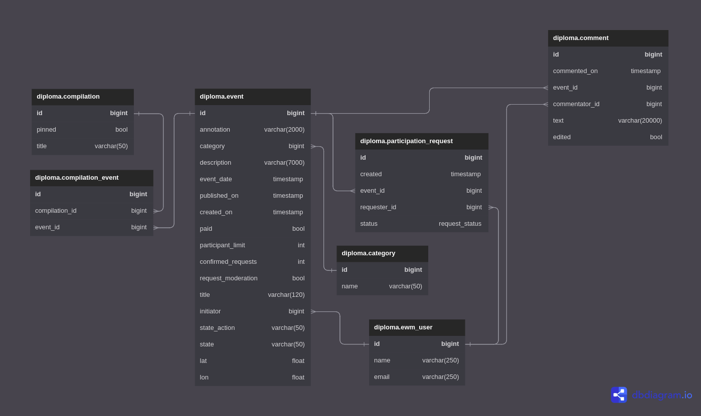

# Explore-with-me

Дипломный проект "Explore With Me" представляет собой бэкэнд афиши,
в которой можно предложить какое-либо событие от выставки до похода
в кино и собрать компанию для участия в нём.

Проект реализован в виде двухмодульного CRUD сервиса.
Сервис поделён на 2 сервиса Основной сервис и Сервис
статистики для фиксирования частоты запросов по публичным эндпоинтам.

Проект использует: Maven, Spring Boot, Spring Data, QueryDSL, Lombock, MapStruct, PostgreSQL.

Cхема базы данных проекта:

Спецификация основного сервиса в swagger:
[Основной сервис](https://app.swaggerhub.com/apis/GOODDAYEMAIL/Diploma_Main_Service_V.1/1.0.0)

Спецификация сервиса статистики в swagger:
[Сервис статистики](https://app.swaggerhub.com/apis/GOODDAYEMAIL/Diploma_Stat_Service_V.1/1.0.0)